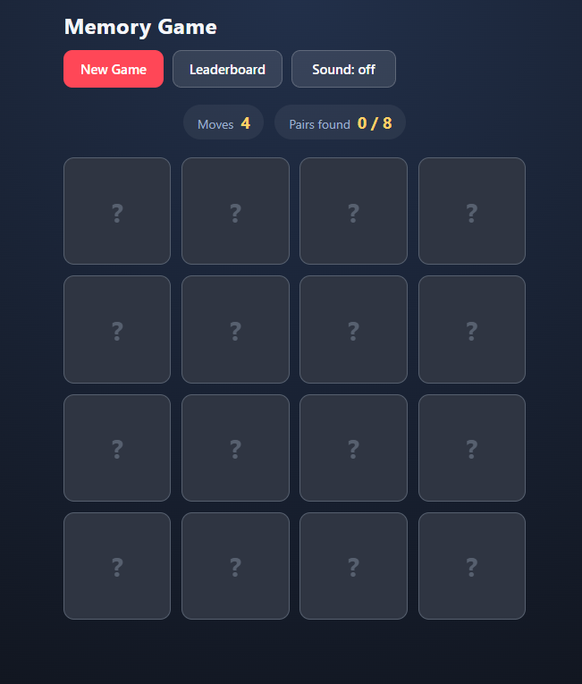
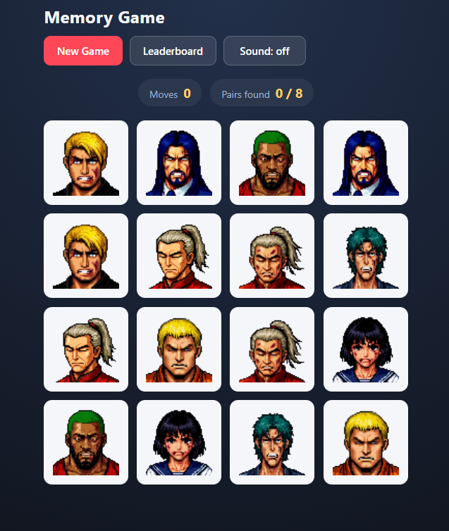

# Memory Game

A memory (pairs matching) game built with plain HTML, CSS and JavaScript for the
[RS School](https://github.com/rolling-scopes-school/tasks/tree/master/tasks/memory-game/) "Memory Game" task. The player turns over cards,
remembers where each picture is and tries to find all 8 pairs in as few moves as
possible. The best results are kept in `localStorage` and shown in a leaderboard.

No libraries, no frameworks, no build step — only the browser platform.

## Live demo

<https://krychvas.github.io/memory-game/>

The application is a set of static files, so it is published with GitHub Pages
directly from the `memory-game` branch.

## Screenshots

| The board during a game | The start-of-game preview |
| :---: | :---: |
|  |  |

## How the task criteria are met

Points are the ones from the task description; the implementation of each item
is listed next to it.

| Criterion | Points | Where it is implemented |
| --- | --- | --- |
| Markup generation | 15 | `index.html` has an empty `<body>` with only the `<script>` tag. Every element is created with `document.createElement`, wrapped by `src/utils/createElement.js`. |
| Game start | 10 | `src/game/createGame.js` → `start()`, called on load from `src/index.js`. 16 cards in 8 pairs, all face down, counters at `0` and `0 / 8`, header buttons available. |
| Shuffling | 5 | `src/utils/shuffle.js` implements Fisher–Yates; it runs on every load and every new game. |
| Card selection | 15 | `handleCardSelect()`: the first card waits for the second, a matched pair stays open, and clicks on open, matched or already selected cards are ignored. |
| Mismatched pairs | 10 | `handleMismatch()`: the pair flips back after `MISMATCH_DELAY_MS` (900 ms, inside the required 700–1500 ms range) while the board stays locked. The timer keeps running even when a dialog is open. |
| Counters | 5 | `moves` grows when the second card of a turn is opened, `pairsFound` on every match; ignored clicks change nothing. Rendered by `src/components/scoreBoard.js`. |
| Modal windows | 15 | `src/components/modal.js` is one shared shell used by both `winModal.js` and `leaderboardModal.js`: creation, opening and closing are written once. Dimmed backdrop, the page behind is inert, scrolling is locked, and a dialog closes with its button, a backdrop click or `Escape`. |
| Leaderboard | 10 | `src/components/leaderboardModal.js` renders the top 10 (place, moves, date as `DD.MM.YYYY`) or an empty-state message. `src/utils/storage.js` keeps the list sorted by moves, then by the earlier game, and caps it at 10. |
| New Game | 15 | Both the header button and the win dialog button call `startNewGame()`, which closes the dialogs and calls `game.start()`. `clearPendingTimers()` cancels a pending mismatch or preview timer, so a restart with an open mismatched pair is instant. |
| README | 5 | This file: description of the app plus local setup instructions. |

### Penalties — all avoided

- The PR contains a deploy link, and the commits follow the RS School
  conventional-commit convention.
- Interface elements are created with `document.createElement` (or the
  `createElement` helper); the source `<body>` holds nothing but `<script>`.
- `innerHTML`, `outerHTML`, `insertAdjacentHTML`, `document.write`,
  `document.writeln`, `DOMParser` and `Range.createContextualFragment` are not
  used anywhere — text is set with `textContent` and nodes are added with
  `append`.
- `alert`, `confirm` and `prompt` are not used; dialogs are native `<dialog>`
  elements.
- No third-party UI, DOM or game-logic library is used.

## Features

- 16 cards / 8 pairs, freshly shuffled with the Fisher–Yates algorithm on every
  page load and on every new game.
- The game starts automatically, with 0 moves and 0 of 8 pairs found.
- Two cards per turn; a matching pair stays open, a mismatching pair stays
  visible for 900 ms and then closes. While it is open, no other card can be
  picked, and repeated clicks on open or matched cards are ignored.
- Moves counter and found-pairs counter.
- Victory dialog with the final number of moves, a "New Game" button and a
  "Close" button.
- Leaderboard dialog with the top 10 results: place, moves and date in
  `DD.MM.YYYY` format. Results with fewer moves go first, ties are broken by the
  earlier game.
- Results are stored in `localStorage`, so they survive a page reload and a
  browser restart. An unfinished game is never saved, and opening the dialogs
  never creates duplicates.
- Responsive layout and visible keyboard focus.

## Music and sound

Sound is an optional extra: the task explicitly says that sound and animations
earn no points. It is layered on top of the required rules and never changes the
scoring behaviour.

**Background music** is a real audio track, `src/audio/Chiptronical.ogg`, played
in a loop once the player switches the sound on. Browsers block audio until the
user interacts with the page, and that switch click is exactly the interaction
they need, so nothing tries to autoplay on load. Its volume is `MUSIC_VOLUME` in
`src/constants/config.js`.

**Sound effects** — turning a card over, a matching pair, a mismatching pair and
a small fanfare on the win — are synthesised at runtime with the Web Audio API in
`src/audio/soundEngine.js`, so no extra asset files are needed for them.

**The switch** in the header ("Sound: on / Sound: off") mutes the music and the
effects together and remembers the choice in `localStorage` under
`memory-game:sound`. On a first visit the game starts with the sound **off**, so
nothing plays until the player asks for it.

**Fallback.** Ogg Vorbis is not supported by every browser (Safari, for
instance). If the file cannot be played, the engine notices and switches to a
melody synthesised with the Web Audio API instead, so the game is never silent
by accident. Setting `MUSIC_URL` to an empty string forces that fallback.

## Start-of-game preview

When a game starts, every card is revealed face up in a diagonal wave for
`CARD_PREVIEW_MS`, then all cards turn back down and the board unlocks. Clicking
during the preview does nothing, and pressing "New Game" cancels the preview
immediately.

> If you prefer the strictest reading of the rules — "on the first load the cards
> lie face down" — set `CARD_PREVIEW_ENABLED` to `false` in
> `src/constants/config.js`. One line, no other change.

## Project structure

```
memory-game/
├── index.html                    # empty <body>, only the module script
├── README.md
└── src/
    ├── index.js                  # builds the UI and wires everything together
    ├── audio/
    │   ├── soundEngine.js        # background track plus synthesised effects
    │   └── Chiptronical.ogg      # background music (see Credits)
    ├── components/
    │   ├── board.js              # playing field and cards
    │   ├── header.js             # header buttons, including the sound switch
    │   ├── leaderboardModal.js   # leaderboard dialog content
    │   ├── modal.js              # shared modal shell (open / close / backdrop)
    │   ├── scoreBoard.js         # moves and pairs counters
    │   └── winModal.js           # victory dialog content
    ├── constants/
    │   ├── cardsData.js          # the 8 pictures
    │   └── config.js             # pairs count, delays, storage keys, music
    ├── game/
    │   └── createGame.js         # game state and rules
    ├── styles/
    │   └── style.css
    ├── utils/
    │   ├── createElement.js      # wrapper around document.createElement
    │   ├── shuffle.js            # Fisher–Yates shuffle
    │   └── storage.js            # localStorage leaderboard and preferences
    └── assets/img/               # card images, app icon and screenshots
```

## Local setup

The application uses native ES modules, so it must be served over HTTP —
opening `index.html` directly from the file system (`file://`) will not work.

Clone the repository and switch to the working branch:

```bash
git clone https://github.com/KrychVas/memory-game.git
cd memory-game
git checkout memory-game
```

Start any static server from the repository root, for example:

```bash
npx serve .
```

or, if Python is installed:

```bash
python -m http.server 8080
```

Then open the printed address (`http://localhost:3000` for `serve`,
`http://localhost:8080` for Python). In VS Code the "Live Server" extension
works as well: right-click `index.html` and choose "Open with Live Server".

No dependencies need to be installed — the project has no build step and no
third-party libraries.

## How to play

1. When a game starts, all cards are shown face up for a moment — remember them.
2. The cards turn back down and you can play: click a card to turn it over, then
   click a second one.
3. If the pictures match, both cards stay open and the pairs counter grows.
4. If they do not match, both cards are shown for a moment and then turn back.
5. Find all 8 pairs — the victory dialog shows how many moves it took.
6. Use "New Game" in the header to reshuffle at any time, "Leaderboard" to see
   the best results, and the sound button to switch the music on or off.

## Credits and assets

- **Card artwork** — pixel-art characters drawn for this project, stored in
  `src/assets/img/`.
- **Background music** — "Chiptronical" by **Patrick de Arteaga**
  (<https://patrickdearteaga.com/>), used under the
  [Creative Commons Attribution (CC BY)](https://creativecommons.org/licenses/by/4.0/)
  licence. Artist, title and date come from the tags embedded in the file:
  `ARTIST=Patrick de Arteaga`, `DATE=2018`; the file also carries an internal
  `TITLE=VK_Creation7582` tag, which is the name the track was distributed under.
- **Sound effects** — synthesised at runtime with the Web Audio API, no assets.
- **Application icon** — the memory board in `src/assets/img/favicon.svg`,
  drawn for this project in the same palette as the interface (card back
  `#2f3542`, accent `#ff4757`, highlight `#ffd166`). The `favicon.ico`,
  `favicon-32x32.png` and `apple-touch-icon.png` files next to it are generated
  from it as fallbacks.
- **Screenshots** — `src/assets/img/screenshot-board.png` and
  `src/assets/img/screenshot-preview.png`, captured from the running
  application.

## Author

Vasyl Krychfalushii — [@KrychVas](https://github.com/KrychVas)
